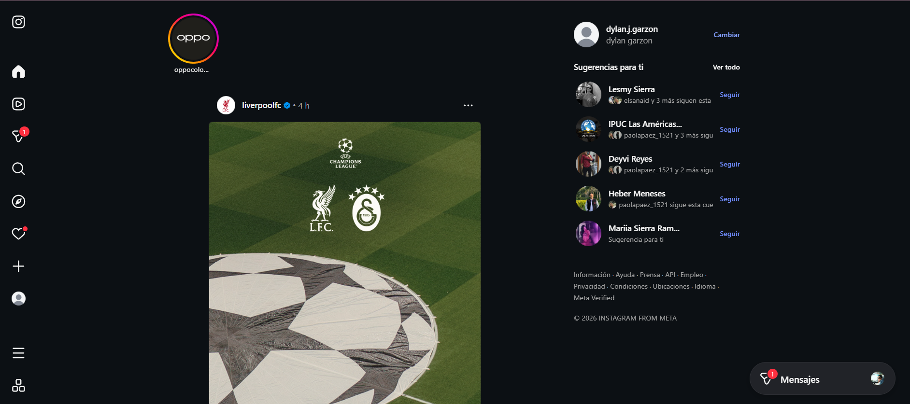

# Auditoría Heurística de Usabilidad – Instagram

## Información General

**Aplicación evaluada:** Instagram  
**Versión:** 320.0 (verificada en Google Play)  
**Plataforma:** Android  

Instagram es una aplicación de red social que permite compartir fotografías, videos, reels e interactuar con otros usuarios mediante comentarios, reacciones y mensajes.

# Alcance de la Auditoría

Para esta auditoría heurística se seleccionaron tres flujos principales de uso que representan acciones frecuentes dentro de la aplicación.

## Flujo A – Registro e inicio de sesión

Permite al usuario acceder a la aplicación mediante su cuenta.

**Justificación:**  
Es uno de los flujos más importantes porque representa el primer contacto del usuario con la aplicación.

## Flujo B – Búsqueda y exploración

Los usuarios pueden buscar perfiles, hashtags o contenido mediante la sección de búsqueda.

**Justificación:**  
La exploración de contenido es una de las funciones principales de Instagram.

## Flujo C – Perfil y configuración

Permite al usuario visualizar su perfil, editar información personal y acceder a configuraciones.

**Justificación:**  
Este flujo permite gestionar la identidad del usuario dentro de la plataforma.

## Evidencia inicial

A continuación se muestra la pantalla principal de la aplicación.

# Objetivo de la Auditoría

Identificar problemas de usabilidad en la aplicación utilizando las **10 heurísticas de Nielsen**, documentar los hallazgos encontrados y proponer mejoras que optimicen la experiencia de usuario.
