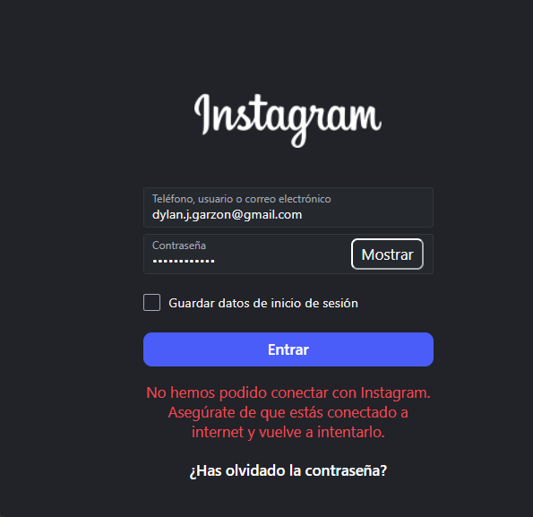
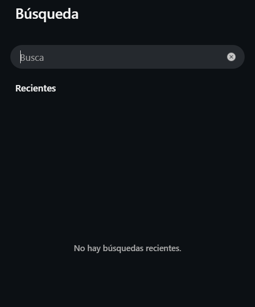
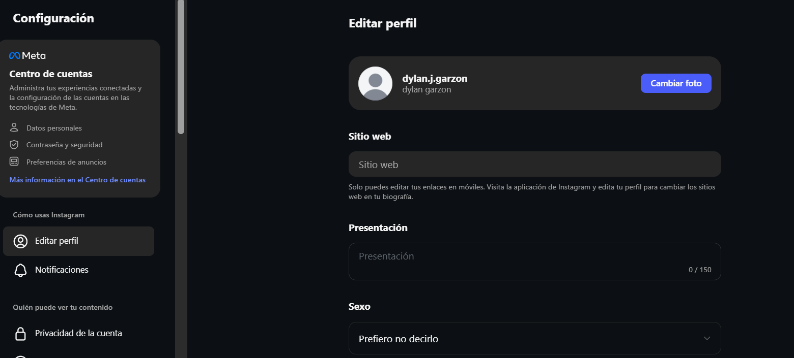

# Checklist de Evaluación Heurística

## H1-A
**Heurística:** H1 - Visibilidad del estado del sistema  
**Pantalla:** Login  
**Descripción:** Cuando el usuario intenta iniciar sesión no aparece un indicador claro de carga.  
**Severidad:** 2  

**Evidencia:**

## H2-A
**Heurística:** H5 - Prevención de errores  
**Pantalla:** Error de inicio de sesión  
**Descripción:** El mensaje de error cuando la contraseña es incorrecta no ofrece suficiente información al usuario.  
**Severidad:** 3  

**Evidencia:**

## H3-B
**Heurística:** H6 - Reconocimiento antes que recuerdo  
**Pantalla:** Búsqueda  
**Descripción:** El historial de búsqueda no facilita recordar búsquedas previas.  
**Severidad:** 2  

**Evidencia:**

## H4-B
**Heurística:** H8 - Diseño minimalista  
**Pantalla:** Resultados de búsqueda  
**Descripción:** La pantalla muestra demasiadas imágenes simultáneamente generando sobrecarga visual.  
**Severidad:** 2  

**Evidencia:**

## H5-C
**Heurística:** H4 - Consistencia y estándares  
**Pantalla:** Perfil  
**Descripción:** Algunos iconos del perfil no tienen etiquetas claras que expliquen su función.  
**Severidad:** 2  

**Evidencia:**

## H6-C
**Heurística:** H10 - Ayuda y documentación  
**Pantalla:** Configuración  
**Descripción:** Algunas opciones de configuración no incluyen explicaciones o ayuda contextual.  
**Severidad:** 3  

**Evidencia:**

